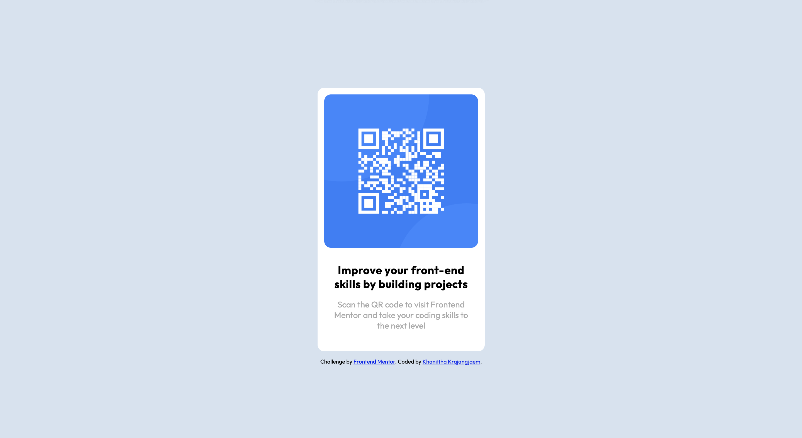

# Frontend Mentor - QR code component solution

This is a solution to the [QR code component challenge on Frontend Mentor](https://www.frontendmentor.io/challenges/qr-code-component-iux_sIO_H). Frontend Mentor challenges help you improve your coding skills by building realistic projects. 

## Table of contents

- [Overview](#overview)
  - [Screenshot](#screenshot)
  - [Built with](#built-with)
- [Author](#author)

## Overview
Frontend project with the challenge of building QR code component to look as close to the original design.

### Screenshot

## Built with

- HTML
- CSS

## Author

- Frontend Mentor - [@kkkraj](https://www.frontendmentor.io/profile/kkkraj)
- Blog - [Khanittha Krajangjaem](https://medium.com/@kkkraj)
